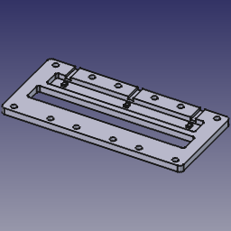
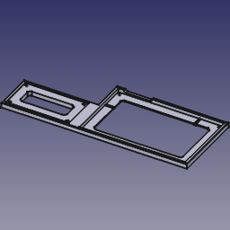
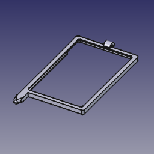
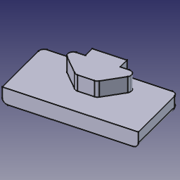
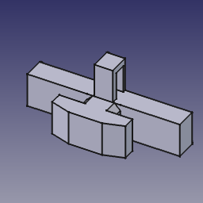
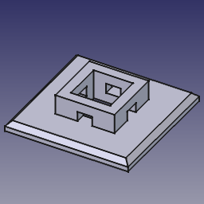
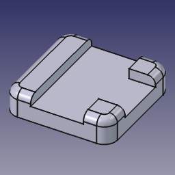
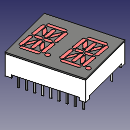

# CAD

Miscellaneous CAD files for 3D printing etc.

<table>
  <tr>
    <td></td>
    <td><a href="Boss-Compact-Pedal-Handler.FCStd">FCStd</a></td>
    <td><a href="Boss-Compact-Pedal-Handler.step">STEP</a></td>
    <td>A pedal board that holds three Boss Compact Pedals (affixed using 5/8'' #4 screws) including a bottom cutout that accommodates the handle on a Fender amplifier.</td>
  <tr>
  <tr>
    <td></td>
    <td><a href="Pigtronix-Infinity-Shoe.FCStd">FCStd</a></td>
    <td><a href="Pigtronix-Infinity-Shoe.step">STEP</a></td>
    <td>A frame that mounts both the Pigtronix Infinity Looper pedal with and its remote switch, making a uniform five-in-line row of buttons.</td>
  </tr>
  <tr>
    <td></td>
    <td><a href="Stylus-Badge-Holder.FCStd">FCStd</a></td>
    <td><a href="Stylus-Badge-Holder.step">STEP</a></td>
    <td>A badge holder with a built-in stylus for Googlers in Chicago Fulton Market, where the elevator floor selection screens are imprecise.</td>
  </tr>
  <tr>
    <td></td>
    <td><a href="1050-End-Cap.FCStd">FCStd</a></td>
    <td><a href="1050-End-Cap.step">STEP</a></td>
    <td>An end cap for an 80/20 1050 extrusion.</td>
  </tr>
  <tr>
    <td></td>
    <td><a href="25-Cable-Tie-Block.FCStd">FCStd</a></td>
    <td><a href="25-Cable-Tie-Block.step">STEP</a></td>
    <td>A twist-in cable tie for an 80/20 25-Series or 10-Series extrusion.</td>
  </tr>
  </tr>
    <td></td>
    <td><a href="Cable-Tie-Pad.FCStd">FCStd</a></td>
    <td><a href="Cable-Tie-Pad.step">STEP</a></td>
    <td>A simple cable-tie pad.</td>
  </tr>
  <tr>
    <td></td>
    <td><a href="IKEA-BILLY-Foot.FCStd">FCStd</a></td>
    <td><a href="IKEA-BILLY-Foot.step">STEP</a></td>
    <td>A leveling foot that fits the front edge of an IKEA BILLY bookshelf.</td>
  </tr>
  <tr>
    <td></td>
    <td><a href="LTP-3784.FCStd">FCStd</a></td>
    <td></td>
    <td>An LTP-3784 dual 7-segment LED component model, fit for use in KiCAD.</td>
  </tr>
</table>
