# CAD

Miscellaneous CAD files for 3D printing etc.

<table>
  <tr>
    <td>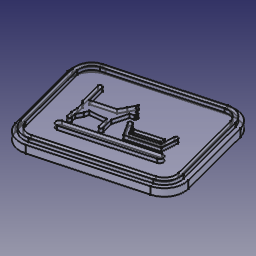</td>
    <td><a href="ISO7001-Litterbox.FCStd">FCStd</a></td>
    <td><a href="ISO7001-Litterbox.step">STEP</a></td>
    <td>An ISO 7001 style sign indicating the location of the litterbox, cat scale. <a href="ISO7001-Litterbox/photo.jpg">Photo</a>.</td>
  <tr>
  <tr>
    <td>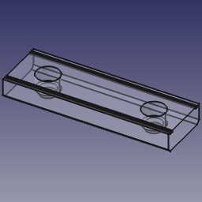</td>
    <td><a href="100mm-PCB-Vice-Jaw.FCStd">FCStd</a></td>
    <td><a href="100mm-PCB-Vice-Jaw.step">STEP</a></td>
    <td>100mm vice jaw with 1.6mm and 2.0mm PCB slots. Turns my spare machine vice into a very very stable PCB vice.</td>
  <tr>
  <tr>
    <td>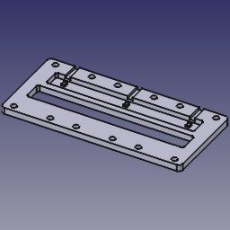</td>
    <td><a href="Boss-Compact-Pedal-Handler.FCStd">FCStd</a></td>
    <td><a href="Boss-Compact-Pedal-Handler.step">STEP</a></td>
    <td>Pedal board that holds three Boss Compact Pedals (affixed using 5/8'' #4 screws) including a bottom cutout that accommodates the handle on a Fender amplifier. <a href="Boss-Compact-Pedal-Handler/photo.jpg">Photo</a>, <a href="Boss-Compact-Pedal-Handler/bottom.jpg">Bottom</a>.</td>
  <tr>
  <tr>
    <td>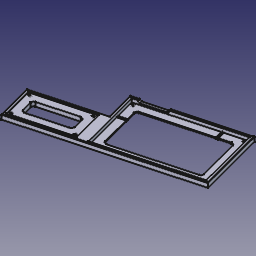</td>
    <td><a href="Pigtronix-Infinity-Shoe.FCStd">FCStd</a></td>
    <td><a href="Pigtronix-Infinity-Shoe.step">STEP</a></td>
    <td>Frame that mounts both the Pigtronix Infinity Looper pedal and its remote switch, making a uniform five-in-line row of buttons. <a href="Pigtronix-Infinity-Shoe/photo.jpg">Photo</a>.</td>
  </tr>
  <tr>
    <td>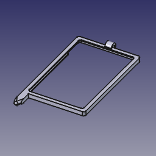</td>
    <td><a href="Stylus-Badge-Holder.FCStd">FCStd</a></td>
    <td><a href="Stylus-Badge-Holder.step">STEP</a></td>
    <td>Badge holder with a built-in stylus for Googlers in Chicago Fulton Market, where the elevator floor selection screens are imprecise.</td>
  </tr>
  <tr>
    <td>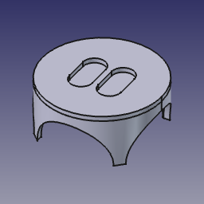</td>
    <td><a href="Android-Display-Stand.FCStd">FCStd</a></td>
    <td>
      <a href="Android-Display-Stand-Base.step">Base</a>
      <a href="Android-Display-Stand-Stand.step">Stand</a>
    </td>
    <td>Snap-fit display stand for Android figures, with slots to hold the feet.</td>
  </tr>
  <tr>
    <td>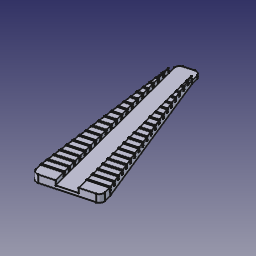</td>
    <td><a href="Resistor-Lead-Bending-Tool.FCStd">FCStd</a></td>
    <td><a href="Resistor-Lead-Bending-Tool.step">STEP</a></td>
    <td>Tool for precisely bending the leads of small resistors. Fully parameterized.</td>
  </tr>
  <tr>
    <td>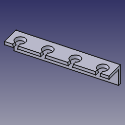</td>
    <td><a href="Cable-Hanger.FCStd">FCStd</a></td>
    <td><a href="Cable-Hanger.step">STEP</a></td>
    <td>Wall mount for cable hanging. Fully parameterized.</td>
  </tr>
  <tr>
    <td>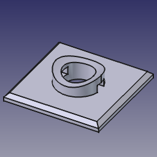</td>
    <td><a href="Cable-Tie-Pad-Round.FCStd">FCStd</a></td>
    <td><a href="Cable-Tie-Pad-Round.step">STEP</a></td>
    <td>Cable tie with a round, inset lug.</td>
  </tr>
  <tr>
    <td>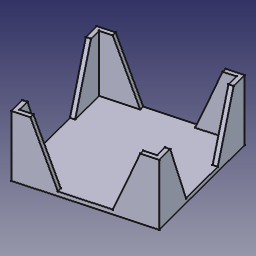</td>
    <td><a href="Square-Coaster-Holder.FCStd">FCStd</a></td>
    <td><a href="Square-Coaster-Holder.step">STEP</a></td>
    <td>Square coaster holder.</td>
  </tr>
  <tr>
    <td>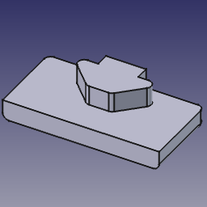</td>
    <td><a href="1050-End-Cap.FCStd">FCStd</a></td>
    <td><a href="1050-End-Cap.step">STEP</a></td>
    <td>End cap for an <a href="https://8020.net/">80/20</a> 1050 extrusion.</td>
  </tr>
  <tr>
    <td>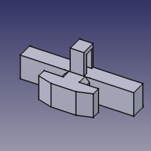</td>
    <td><a href="25-Cable-Tie-Block.FCStd">FCStd</a></td>
    <td><a href="25-Cable-Tie-Block.step">STEP</a></td>
    <td>Twist-in cable tie for an <a href="https://8020.net/">80/20</a> 25-Series or 10-Series extrusion.</td>
  </tr>
  </tr>
    <td>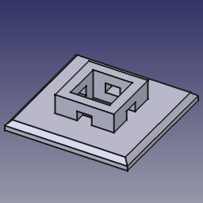</td>
    <td><a href="Cable-Tie-Pad.FCStd">FCStd</a></td>
    <td><a href="Cable-Tie-Pad.step">STEP</a></td>
    <td>Simple cable-tie pad.</td>
  </tr>
  <tr>
    <td>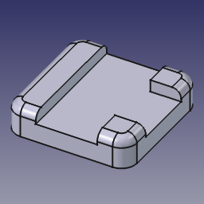</td>
    <td><a href="IKEA-BILLY-Foot.FCStd">FCStd</a></td>
    <td><a href="IKEA-BILLY-Foot.step">STEP</a></td>
    <td>Leveling foot that fits the front edge of an IKEA BILLY bookshelf.</td>
  </tr>
  <tr>
    <td>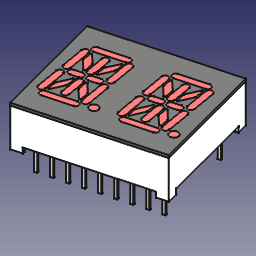</td>
    <td><a href="LTP-3784.FCStd">FCStd</a></td>
    <td></td>
    <td>LTP-3784 dual 14-segment alphanumeric LED display component, fit for use in KiCAD.</td>
  </tr>
</table>
